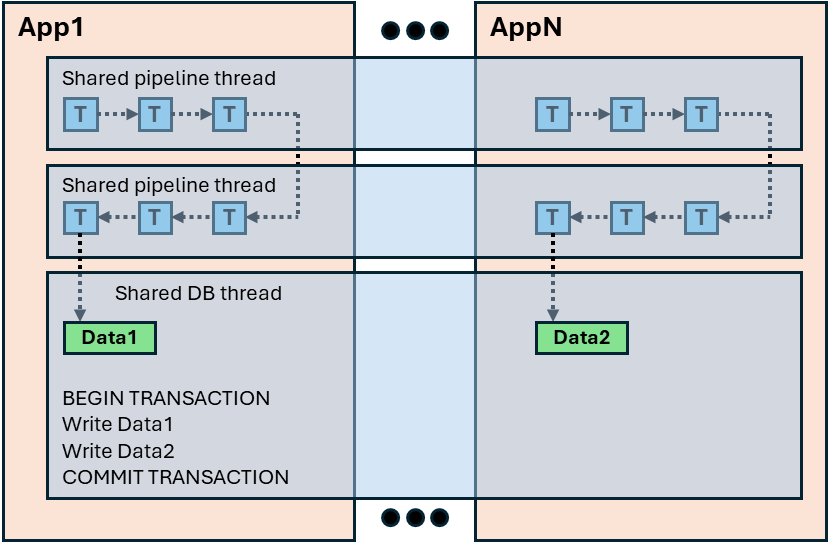

# SimDB — High-Performance Simulation Database

SimDB is a high-performance module that unifies **concurrent data pipelines** with **SQLite** to power scalable simulation data engines, analysis tooling, and UI backends. It provides a clean, modular foundation suitable for both simple and complex features in large simulation codebases.

SimDB is a header-only C++17 module whose only required dependency is sqlite3.

---

## Why choose SimDB?

### Unified Concurrent Pipelines + SQLite
SimDB helps you build performant concurrent pipelines for SQLite. Its native integration with SQLite yields pipelines without database contention and with automatic batch-processing of database work on a single database thread.

### High Performance
SimDB is designed for extremely high throughput suitable for concurrent / multi-threaded systems:

- Minimizes transaction overhead
- Eliminates database access contention
- Shares worker threads across multiple running apps for efficient scaling
- Supports move-only semantics for pipeline data, though you can copy data too

### A Clean Break for Complex Codebases
Large simulation projects often suffer from tangled data paths, unbounded coupling, or legacy “write everything to files” architectures. SimDB replaces these with a clean, unified, highly optimized pipeline, helping teams reach performant solutions more quickly and with fewer moving parts.

---

## What Makes the Implementation Unique

SimDB abstracts away the pitfalls and complexities of using a filesystem-backed database concurrently:

- **No user-facing transactions required** — Avoid slow, tiny transactions and implicit file locks; SimDB batches and routes operations automatically.
- **Retry-on-fail implicit transactions** — Database transactions are retried until successful in the event of locked tables or other access issues.
- **No manual concurrency management** — No need to coordinate access to SQLite or worry about schema-level lock contention. SimDB ensures safe, high-throughput execution under heavy parallel workloads.
- **Unified output: “one DB to rule them all”** — Consolidates all simulation output into a single, queryable SQLite database: simulation stats, trace data, UI updates, analysis results, etc.
- **Shared threading model for scalability** — Multiple applications can run concurrently with the same database, and threads are shared appropriately for optimal scaling. Thread sharing occurs implicitly, though you can request dedicated threads for an app if need be (except the database thread; there is only one).

---

## What You Can Build with SimDB

SimDB enables a wide range of high-performance simulation and analysis workflows:

- Fast and scalable simulation statistics engines
- UI backends for live dashboards or post-simulation analysis
- Simulation state replayer backends
- Aggregate analysis across hundreds or thousands of simulations

---

## Ideal For

- Simulation frameworks needing scalable, consistent data handling  
- CPU/GPU performance modelers requiring extremely fast, low-overhead pipelines  
- Researchers analyzing large batches of simulation experiments  
- UI/visualization tools with real-time or batch data access  
- Teams that need to refactor or decouple overly complex simulation infrastructure  

---

## Code Snippets: Pipeline Creation

SimDB pipelines are created by defining a series of stages (pipeline elements) with specific I/O data types, connecting them together, and assigning these stages to one or more threads.

### Pipeline Elements

The following elements are provided by SimDB (other modules might call these "tasks", "filters", "stages", or "transforms"):

- Simple I/O function
- Buffers, circular buffers
- Database tasks for read/write operations on the dedicated DB thread

The Function/DatabaseTask objects allow void-input and/or void-output.

Users can also define their own pipeline elements, for instance:

- Muxers
- Routers/switches
- Reorder buffers

### Example

Here is a code snippet for a simple pipeline:

```
namespace pipe = simdb::pipeline;

// Task 1: Accept a timestamp and a vector of stats and compress them
using ZlibIn  = std::pair<uint64_t, std::vector<double>>;
using ZlibOut = std::pair<uint64_t, std::vector<char>>;

auto compress = pipe::createTask<pipe::Function<ZlibIn, ZlibOut>>(
    [](ZlibIn&& uncompressed,
       simdb::ConcurrentQueue<ZlibOut>& out,
       bool /*force*/)
    {
        ZlibOut compressed;

        // Carry forward timestamp
        compressed.first = uncompressed.first;

        // Perform zlib compression
        simdb::compressData(uncompressed.second, compressed.second);

        // Send to task 2
        out.emplace(std::move(compressed));

        // Tell SimDB we did something. Pipelines are greedy and only
        // go to sleep for a bit when all stages had nothing to do.
        return pipe::RunnableOutcome::DID_WORK;
    }
);

// Task 2: Write compressed data to SQLite
using DatabaseIn  = ZlibOut;
using DatabaseOut = void;
auto write = pipe::createTask<pipe::DatabaseTask<DatabaseIn, DatabaseOut>>(
    db_mgr_, // - - - - - - - - - - SimDB apps all have the database manager
    [](DatabaseIn&& compressed,
       pipe::DatabaseAccessor& accessor,
       bool /*force*/)
    {
        const auto timestamp = compressed.first;
        const auto & bytes = compressed.second;

        // Schema is defined by the app elsewhere. Note that this code
        // is implicitly on the dedicated DB thread, and we are already
        // inside a batched BEGIN/COMMIT TRANSACTION block.
        accessor.getDatabaseManager()->INSERT(
            SQL_TABLE("CompressedStats"),
            SQL_COLUMNS("Timestamp", "RawBytes"),
            SQL_VALUES(timestamp, bytes)
        );

        // Keep greedily consuming.
        return pipe::RunnableOutcome::DID_WORK;
    }
);

// Connect tasks.
*compress >> *write;

// Save the input queue to the first task.
pipeline_head_ = compress->getTypedInputQueue<ZlibIn>();

// Later on, this app can send stats down the pipeline:
//
//   void StatsCollectorApp::send(std::vector<double>&& stats)
//   {
//       // Assumed that your simulation has some API to get the sim time:
//       uint64_t timestamp = sim_->getCurrentTime();
//
//       // Package it up and send:
//       ZlibIn payload = std::make_pair(timestamp, std::move(stats));
//       pipeline_head_->emplace(std::move(payload));
//   }
```

This is a simple one-way pipeline with a single input, but pipelines can have multiple inputs and graphs/feedback loops. A one-way pipeline is used here for brevity.

See examples/PipelineCache/main.cpp for a complete pipeline app.

See examples/CompressionPool/main.cpp for a user-defined element (ReorderBuffer).

---

## Code Snippets: SQLite Interface

### Schema Creation

```
using dt = simdb::SqlDataType;
simdb::Schema schema;
auto& tbl = schema.addTable("CompressedStats")
tbl.addColumn("Timestamp", dt::uint64_t);
tbl.addColumn("RawBytes", dt::blob_t);

// Optionally:
//   Create table indexes...
//   Assign column default values...
//   Disable auto-incrementing Id column...
```

See test/sqlite/Schema/Schema.cpp

### Database Creation

```
simdb::DatabaseManager db_mgr("stats.db");

// You can call this method more than once if additional tables are needed later.
db_mgr.appendSchema(schema);

// SQLite connection is now open.
```

### Record INSERT

```
// From the above pipeline example:
db_mgr.INSERT(
    SQL_TABLE("CompressedStats"),
    SQL_COLUMNS("Timestamp", "RawBytes"),
    SQL_VALUES(timestamp, bytes)
);

// Or use prepared statements:
auto data_insert_stmt = db_mgr.prepareINSERT(
    SQL_TABLE("CompressedStats"),
    SQL_COLUMNS("Timestamp", "RawBytes")
);

// Reuse over and over:
data_insert_stmt->setColumnValue(0, time1);
data_insert_stmt->setColumnValue(1, bytes1);
data_insert_stmt->createRecord();

data_insert_stmt->setColumnValue(0, time2);
data_insert_stmt->setColumnValue(1, bytes2);
data_insert_stmt->createRecord();
```

See test/sqlite/Insert/Insert.cpp

### Record SELECT

```
// SELECT RawBytes FROM CompressedStats
// WHERE Timestamp >= 100 AND Timestamp <= 200
auto query = db_mgr.createQuery("CompressedStats");
query->addConstraintForUInt64("Timestamp", simdb::Constraints::GREATER_EQUAL, 100);
query->addConstraintForUInt64("Timestamp", simdb::Constraints::LESS_EQUAL, 200);

std::vector<char> bytes;
query->select("RawBytes", bytes);

auto results = query->getResultSet();
while (results.getNextRecord()) {
    std::vector<double> stats;
    simdb::decompressData(bytes, stats);
    // Process stats...
}
```

See test/sqlite/Query/Query.cpp

---

## Regression Tests

```
mkdir build
cd build
cmake ..
make -j simdb_regress
```

---

## SimDB Architecture



---

## Performance Benchmarks

_Coming soon._
